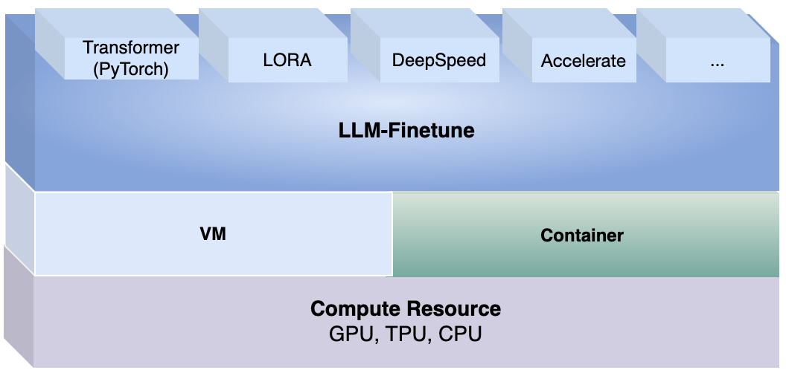

# LLM - Finetune

The framework of training large language models，support lora, full parameters fine tune etc, define yaml to start training/fine tune of your defined models, data and methods. Easy define and easy start. A large-scale model training framework that supports tasks such as LoRA and full-parameter fine-tuning. Easily initiate your large model training and fine-tuning work by defining a YAML file specifying the base model, dataset, and training parameters. Feedback and stars⭐️ are welcome!



Two steps to run your LLM finetune:

## 1. Easy Install

### Installation

Use SHELL `bash` for command

```bash
git clone https://github.com/OpenCSGs/llm-finetune.git
cd llm-finetune
pip install .  # Install from CN: 'pip install . -i https://pypi.tuna.tsinghua.edu.cn/simple'
```

## 2. Easy Run
### Finetune model by command

```
llmfinetune run-ft --ft=./models/ft--sequenceclassification--bert-base-uncased-lora.yaml
```

Your Finetune task is starting now. 

- You can add more yaml for your own to define your tasks.

*******
## (Optional) Addtional launcher: Launch by accelerate or deepspeed
Ensure accelerate and deepspeed are installed, then follow below steps.

### Launch by accelerate

Modify parameters of `accelerate launch` for distributed train.

#### Finetune on CPU

```
# Use CPU
accelerate launch --cpu --num_machines=1 --num_processes=1 --num_cpu_threads_per_process=1 --mixed_precision=no --dynamo_backend=no llm_finetune.py run-ft --ft=/Users/hub/code/jihulab/opencsg/llm-inference/models/ft--sequenceclassification--bert-base-cased.yaml
```

#### Finetune on GPU on single host

Control GPU Visibility with `CUDA_VISIBLE_DEVICES`. 

```
# Use GPU:0
CUDA_VISIBLE_DEVICES=0 accelerate launch llmfinetune run-ft --ft=./models/ft--sequenceclassification--bert-base-uncased-lora.yaml

# Use GPU:1 
CUDA_VISIBLE_DEVICES=1 accelerate launch llmfinetune run-ft --ft=./models/ft--sequenceclassification--bert-base-uncased-lora.yaml

# Use GPU:0
accelerate launch --num_machines=1 --num_processes=1 --gpu_ids=0 llmfinetune ...
```

#### Finetune on multi-GPUs on single host

```
# Use all GPUs with mixed precision disabled
accelerate launch --multi_gpu llmfinetune ...

# Use all GPUs with mxied precision
accelerate launch --multi_gpu --mixed_precision=fp16 llmfinetune ...

# Use GPU:0 and GPU:1
CUDA_VISIBLE_DEVICES=0,1 accelerate launch --multi_gpu --gpu_ids=0,1 llmfinetune ...

# Launch with 2 GPUs
accelerate launch --multi_gpu --num_processes 2 llmfinetune ...
```

```
# Use default_config.yaml
compute_environment: LOCAL_MACHINE
deepspeed_config: {}
distributed_type: MULTI_GPU
downcast_bf16: 'no'
machine_rank: 'NO'
fsdp_config: {}
gpu_ids: all                  # all GPUs id
machine_rank: 0
main_training_function: main
megatron_lm_config: {}
mixed_precision: fp16         # mixed precsion
num_machines: 1               # a single machine
num_processes: 4              # 4 GPUs
rdzv_backend: static
same_network: true
use_cpu: false


accelerate launch --config_file default_config.yaml llmfinetune ...
```

#### Finetune on multi-GPUs on multi-hosts

All hosts need access without password each other

```
# default_config.yaml
compute_environment: LOCAL_MACHINE
deepspeed_config:
  deepspeed_multinode_launcher: standard
  gradient_accumulation_steps: 1
  gradient_clipping: 1.0
  offload_optimizer_device: none
  offload_param_device: none
  zero3_init_flag: true
  zero3_save_16bit_model: true
  zero_stage: 3
distributed_type: DEEPSPEED
downcast_bf16: 'no'
dynamo_config: {}
fsdp_config: {}
main_training_function: main
megatron_lm_config: {}
mixed_precision: fp16
num_machines: 2               # 2 nodes
num_processes: 16             # 16 GPUs of all nodes 
tpu_env: []
tpu_use_cluster: false
tpu_use_sudo: false
use_cpu: false

# Run on all hosts by specify `RANK`, `MASTER_ADDR`, `MASTER_PORT`
accelerate launch --config_file default_config.yaml \
    --machine_rank ${RANK} \
    --main_process_ip ${MASTER_ADDR} \
    --main_process_port ${MASTER_PORT} \ 
    ...

# --machine_rank: 0 for the main/master node, for other nodes is 1,2,3 etc.
```

#### Finetune by Deepspeed for multi-GPUs on multi-hosts

All hosts need access without password each other

```
# myhostfile
node1 slots=1
node2 slots=1

# deepspeed.json
{
    "train_batch_size": "auto",
    "train_micro_batch_size_per_gpu": "auto",
    "gradient_accumulation_steps": "auto",
    "gradient_clipping": "auto",
    "zero_allow_untested_optimizer": true,
    "fp16": {
      "enabled": "auto",
      "loss_scale": 0,
      "initial_scale_power": 16,
      "loss_scale_window": 1000,
      "hysteresis": 2,
      "min_loss_scale": 1
    },
    "zero_optimization": {
      "stage": 2,
      "allgather_partitions": true,
      "allgather_bucket_size": 5e8,
      "reduce_scatter": true,
      "reduce_bucket_size": 5e8,
      "overlap_comm": false,
      "contiguous_gradients": true
    }
}

deepspeed --num_nodes=2 --hostfile=myhostfile --deepspeed deepspeed.json ...

# --num_nodes: num of host
# --hostfile:  host file include all hosts IP and num of GPUs
# --deepspeed: deepspeed config file

```


